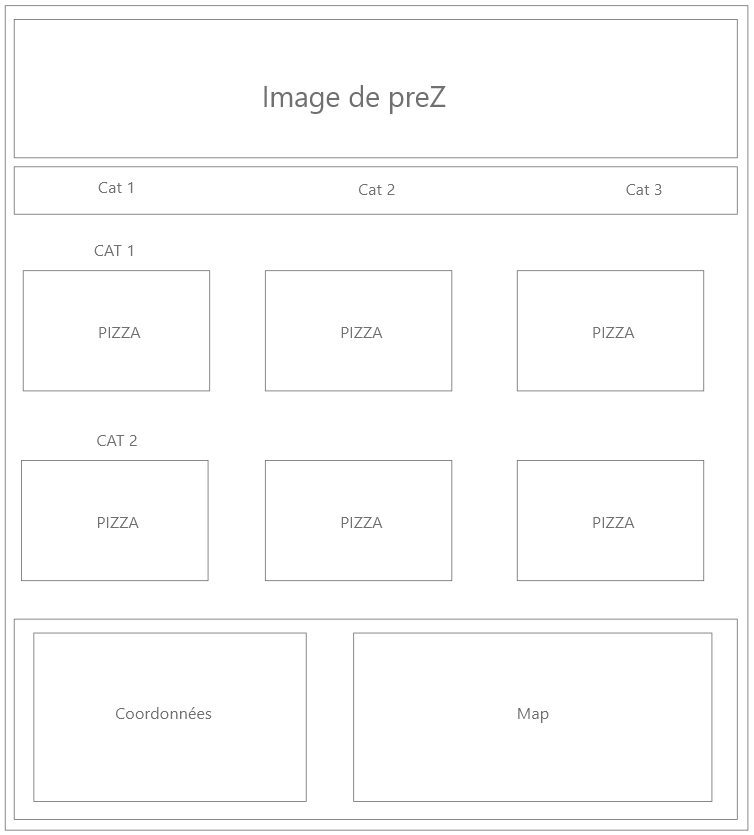
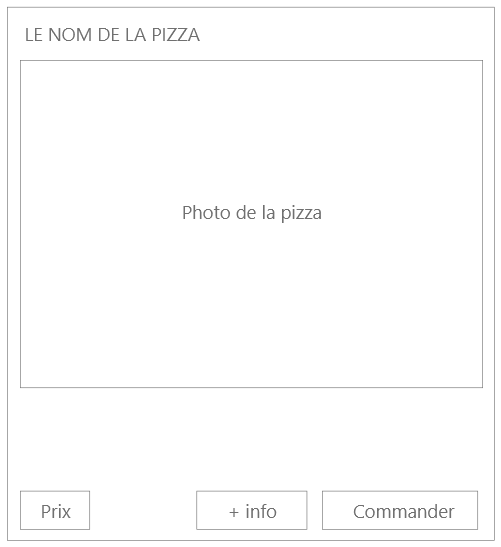
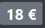
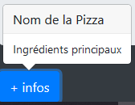
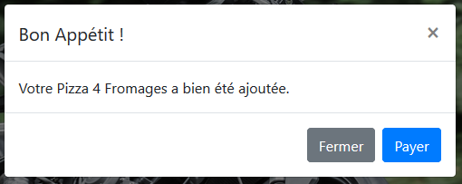

# TP Let's eaaaaaaat

> Le TP doit respecter les normes et les standards du WEB (ex. <https://www.w3.org/> et <https://checklists.opquast.com/fr/)>

## Carte de plats pour un "restaurant fictif"

**BRAVO**, vos prestations ont été remarquées : Vous êtes chargés de créer la page web d'une carte d'un restaurant partenaire Afpa.

Voici le cahier des charges :

* Une barre de navigation permettant de naviguer dans les différentes sections (*3 au total*).
* 3 plats à mettre en avant dans chaque section (*ex. Entrées, Plats, Desserts*), ils devront être en photo : ***Attention Images libres de droits***
* 1 Footer avec :

  * L'emplacement du restaurant.
  * Les coordonnées.
  * Les horaires.
  * Les Mentions légales.

Exemple de maquette pour une pizzeria :
  

**Le site n'ayant pas de visuels, à vous d'aller chercher les images dans des banques d'images gratuites.  
***Utilisation du site <https://www.remove.bg/> pour **détourer** vos images si besoin.  

## Le sens du détail

Chaque plat devra être présenté dans une **card** avec les éléments suivants :

* Le nom du plat.
* La photo du plat.
* Un prix sous forme de **badge**.
* 1 **bouton** "+ infos" qui ouvrira un **Popovers** contenant les ingredients.
* 1 **bouton** commander qui ouvrira une **Modal** indiquant que le plat a bien été ajoutée au panier.

ex. Card :  

ex. Prix :  
  

ex. Popovers :  

ex. Modal :  

## Structure du dossier

Le dossier de ce test sera composé de cette manière :

* index.html
* assets
  * img
    * images_du_site
  * css
    * style.css

## Les fameuses contraintes

* Utiliser majoritairement *des classes bootstrap* : **Votre site doit être responsive**.
* La navbar doit bénéficier de la fonction : **Scrollspy** ( <https://getbootstrap.com/docs/5.0/components/scrollspy/> )
* Utilisation de l'anglais lors de la création de vos **class** et de vos **id**.
* Un code **propre** avec une belle **indentation** pour plus de lisibilité.

## Le mot de la **faim**

> Miam.
